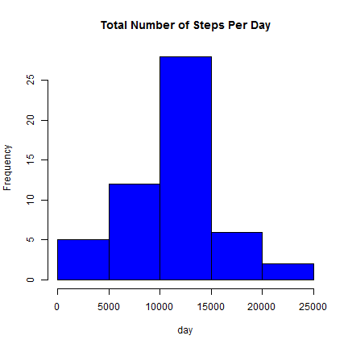
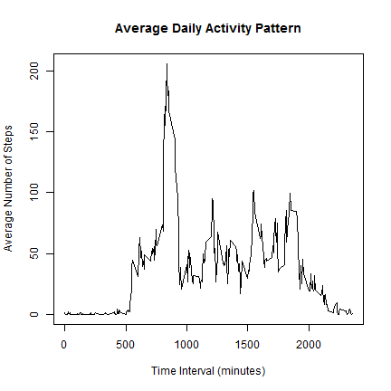
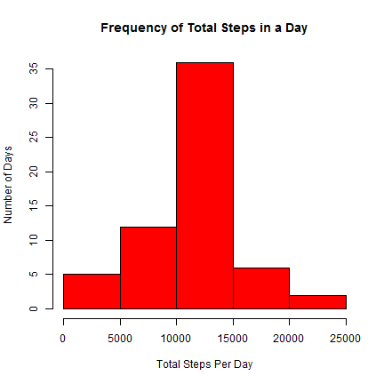
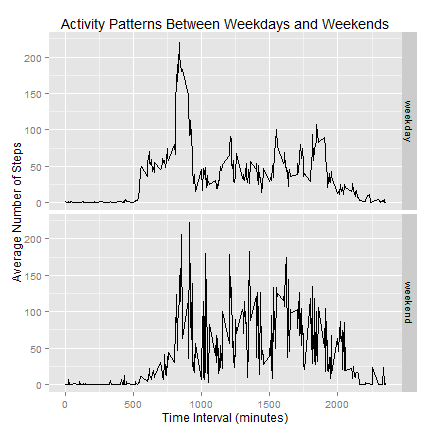

<<<<<<< HEAD
# Reproducible Research: Peer Assessment 1

## Introduction
This assignment makes use of data from a personal activity monitoring device. This device collects data at 5 minute intervals through out the day. The data consists of two months of data from an anonymous individual collected during the months of October and November, 2012 and include the number of steps taken in 5 minute intervals each day.

## Data
The variables included in this dataset are:

- steps: Number of steps taking in a 5-minute interval (missing values are coded as NA)
- date: The date on which the measurement was taken in YYYY-MM-DD format
- interval: Identifier for the 5-minute interval in which measurement was taken

The dataset is stored in a comma-separated-value (CSV) file and there are a total of 17,568 observations in this dataset.

## Assignment


### 1. Loading and preprocessing the data


```r
url <- "http://d396qusza40orc.cloudfront.net/repdata%2Fdata%2Factivity.zip"
download.file(url, destfile = "pa1.zip", mode="wb")
dateDownloaded <- date()
unzip("pa1.zip", files = NULL, list = FALSE, overwrite = TRUE,
              junkpaths = FALSE, exdir = ".", unzip = "internal",
              setTimes = FALSE)
data <- read.csv('activity.csv', header = TRUE)
str(data)
```

```
'data.frame':	17568 obs. of  3 variables:
 $ steps   : int  NA NA NA NA NA NA NA NA NA NA ...
 $ date    : Factor w/ 61 levels "2012-10-01","2012-10-02",..: 1 1 1 1 1 1 1 1 1 1 ...
 $ interval: int  0 5 10 15 20 25 30 35 40 45 ...
```

```r
## convert date to date data type
data$date <- as.Date(data$date, "%Y-%m-%d") 
```
### 2. What is mean total number of steps taken per day?

```r
TotalSteps <- aggregate(steps ~ date, data = data, sum)
hist(TotalSteps$steps, , main = "Total Number of Steps Per Day", xlab = "day", col = "blue")
```

 

```r
MeanSteps <- mean(TotalSteps$steps)
MedianSteps <- median(TotalSteps$steps)
print(sprintf("Mean total steps taken per day: %f ", MeanSteps))
```

```
[1] "Mean total steps taken per day: 10766.188679 "
```

```r
print(sprintf("Median total steps taken per day: %f ", MedianSteps))
```

```
[1] "Median total steps taken per day: 10765.000000 "
```
### 3. What is the average daily activity pattern?

```r
library(dplyr)
# Removes date factors corresponding to NA values
adata <- na.omit(data)
adata$date <- as.factor(as.character(adata$date))

AvgStepsTime <- adata %>% group_by(interval) %>% summarize(avgsteps = mean(steps), na.rm = TRUE)

plot(AvgStepsTime$interval, AvgStepsTime$avgsteps, type = "l",
     xlab = "Time Interval (minutes)", 
     ylab = "Average Number of Steps", 
     main = "Average Daily Activity Pattern") 
```

 

```r
MaxAvgInterval <- AvgStepsTime$interval[AvgStepsTime$avgsteps == max(AvgStepsTime$avgsteps)]

print(sprintf("The 5-min time interval with maximum average steps taken per day: %i ", 
              MaxAvgInterval))
```

```
[1] "The 5-min time interval with maximum average steps taken per day: 835 "
```
### 4. Imputing missing values

```r
MissingData <- sum(is.na(data))
print(sprintf("The total number of missing values in the dataset: %i ", MissingData))
```

```
[1] "The total number of missing values in the dataset: 2304 "
```

```r
## Strategy for filling in all of the missing values in the dataset : mean for that 5-minute interval
## will be used to replace missing values

print ("Strategy to replace misiing values: mean for the corresponding 5-minute interval will be used to replace missing values")
```

```
[1] "Strategy to replace misiing values: mean for the corresponding 5-minute interval will be used to replace missing values"
```

```r
newdata <- data

sapply(unique(data$interval), 
       function(x) newdata[!complete.cases(newdata) & newdata$interval ==x, 1]
       <<- AvgStepsTime$avgsteps[AvgStepsTime$interval == x])
```

```
  [1]   1.7169811   0.3396226   0.1320755   0.1509434   0.0754717
  [6]   2.0943396   0.5283019   0.8679245   0.0000000   1.4716981
 [11]   0.3018868   0.1320755   0.3207547   0.6792453   0.1509434
 [16]   0.3396226   0.0000000   1.1132075   1.8301887   0.1698113
 [21]   0.1698113   0.3773585   0.2641509   0.0000000   0.0000000
 [26]   0.0000000   1.1320755   0.0000000   0.0000000   0.1320755
 [31]   0.0000000   0.2264151   0.0000000   0.0000000   1.5471698
 [36]   0.9433962   0.0000000   0.0000000   0.0000000   0.0000000
 [41]   0.2075472   0.6226415   1.6226415   0.5849057   0.4905660
 [46]   0.0754717   0.0000000   0.0000000   1.1886792   0.9433962
 [51]   2.5660377   0.0000000   0.3396226   0.3584906   4.1132075
 [56]   0.6603774   3.4905660   0.8301887   3.1132075   1.1132075
 [61]   0.0000000   1.5660377   3.0000000   2.2452830   3.3207547
 [66]   2.9622642   2.0943396   6.0566038  16.0188679  18.3396226
 [71]  39.4528302  44.4905660  31.4905660  49.2641509  53.7735849
 [76]  63.4528302  49.9622642  47.0754717  52.1509434  39.3396226
 [81]  44.0188679  44.1698113  37.3584906  49.0377358  43.8113208
 [86]  44.3773585  50.5094340  54.5094340  49.9245283  50.9811321
 [91]  55.6792453  44.3207547  52.2641509  69.5471698  57.8490566
 [96]  56.1509434  73.3773585  68.2075472 129.4339623 157.5283019
[101] 171.1509434 155.3962264 177.3018868 206.1698113 195.9245283
[106] 179.5660377 183.3962264 167.0188679 143.4528302 124.0377358
[111] 109.1132075 108.1132075 103.7169811  95.9622642  66.2075472
[116]  45.2264151  24.7924528  38.7547170  34.9811321  21.0566038
[121]  40.5660377  26.9811321  42.4150943  52.6603774  38.9245283
[126]  50.7924528  44.2830189  37.4150943  34.6981132  28.3396226
[131]  25.0943396  31.9433962  31.3584906  29.6792453  21.3207547
[136]  25.5471698  28.3773585  26.4716981  33.4339623  49.9811321
[141]  42.0377358  44.6037736  46.0377358  59.1886792  63.8679245
[146]  87.6981132  94.8490566  92.7735849  63.3962264  50.1698113
[151]  54.4716981  32.4150943  26.5283019  37.7358491  45.0566038
[156]  67.2830189  42.3396226  39.8867925  43.2641509  40.9811321
[161]  46.2452830  56.4339623  42.7547170  25.1320755  39.9622642
[166]  53.5471698  47.3207547  60.8113208  55.7547170  51.9622642
[171]  43.5849057  48.6981132  35.4716981  37.5471698  41.8490566
[176]  27.5094340  17.1132075  26.0754717  43.6226415  43.7735849
[181]  30.0188679  36.0754717  35.4905660  38.8490566  45.9622642
[186]  47.7547170  48.1320755  65.3207547  82.9056604  98.6603774
[191] 102.1132075  83.9622642  62.1320755  64.1320755  74.5471698
[196]  63.1698113  56.9056604  59.7735849  43.8679245  38.5660377
[201]  44.6603774  45.4528302  46.2075472  43.6792453  46.6226415
[206]  56.3018868  50.7169811  61.2264151  72.7169811  78.9433962
[211]  68.9433962  59.6603774  75.0943396  56.5094340  34.7735849
[216]  37.4528302  40.6792453  58.0188679  74.6981132  85.3207547
[221]  59.2641509  67.7735849  77.6981132  74.2452830  85.3396226
[226]  99.4528302  86.5849057  85.6037736  84.8679245  77.8301887
[231]  58.0377358  53.3584906  36.3207547  20.7169811  27.3962264
[236]  40.0188679  30.2075472  25.5471698  45.6603774  33.5283019
[241]  19.6226415  19.0188679  19.3396226  33.3396226  26.8113208
[246]  21.1698113  27.3018868  21.3396226  19.5471698  21.3207547
[251]  32.3018868  20.1509434  15.9433962  17.2264151  23.4528302
[256]  19.2452830  12.4528302   8.0188679  14.6603774  16.3018868
[261]   8.6792453   7.7924528   8.1320755   2.6226415   1.4528302
[266]   3.6792453   4.8113208   8.5094340   7.0754717   8.6981132
[271]   9.7547170   2.2075472   0.3207547   0.1132075   1.6037736
[276]   4.6037736   3.3018868   2.8490566   0.0000000   0.8301887
[281]   0.9622642   1.5849057   2.6037736   4.6981132   3.3018868
[286]   0.6415094   0.2264151   1.0754717
```

```r
NoMissingData <- newdata %>% group_by(date) %>% summarize(TotalSteps = sum(steps, na.rm = TRUE))

hist(NoMissingData$TotalSteps, xlab = "Total Steps Per Day", ylab = "Number of Days", main = "Frequency of Total Steps in a Day", col = "red")
```

 

```r
NoMissingMeanSteps <- mean(TotalSteps$steps)
NoMissingMedianSteps <- median(TotalSteps$steps)
print(sprintf("Mean total steps taken per day (missing values replaced): %f ", NoMissingMeanSteps))
```

```
[1] "Mean total steps taken per day (missing values replaced): 10766.188679 "
```

```r
print(sprintf("Mean total steps taken per day (missing values not replaced): %f ", MeanSteps))
```

```
[1] "Mean total steps taken per day (missing values not replaced): 10766.188679 "
```

```r
print(sprintf("Median total steps taken per day (missing values replaced): %f ", NoMissingMedianSteps))
```

```
[1] "Median total steps taken per day (missing values replaced): 10765.000000 "
```

```r
print(sprintf("Median total steps taken per day (missing values not replaced): %f ", MedianSteps))
```

```
[1] "Median total steps taken per day (missing values not replaced): 10765.000000 "
```

```r
print("Mean and median of total steps taken per day are same before and after replacing missing values ")
```

```
[1] "Mean and median of total steps taken per day are same before and after replacing missing values "
```
### 4. Are there differences in activity patterns between weekdays and weekends?

```r
NewData <- newdata %>% mutate(day = ifelse(as.factor(weekdays(newdata$date)) == c("Saturday", "Sunday"), "weekend", "weekday")) %>% group_by (interval, day) %>% summarize(AvgSteps = mean(steps))

library(ggplot2)
qplot(x = interval, y = AvgSteps, data = NewData, geom = c("line"), facets = day~., 
      xlab= "Time Interval (minutes)", ylab = "Average Number of Steps", main = "Activity Patterns Between Weekdays and Weekends")
```

 


